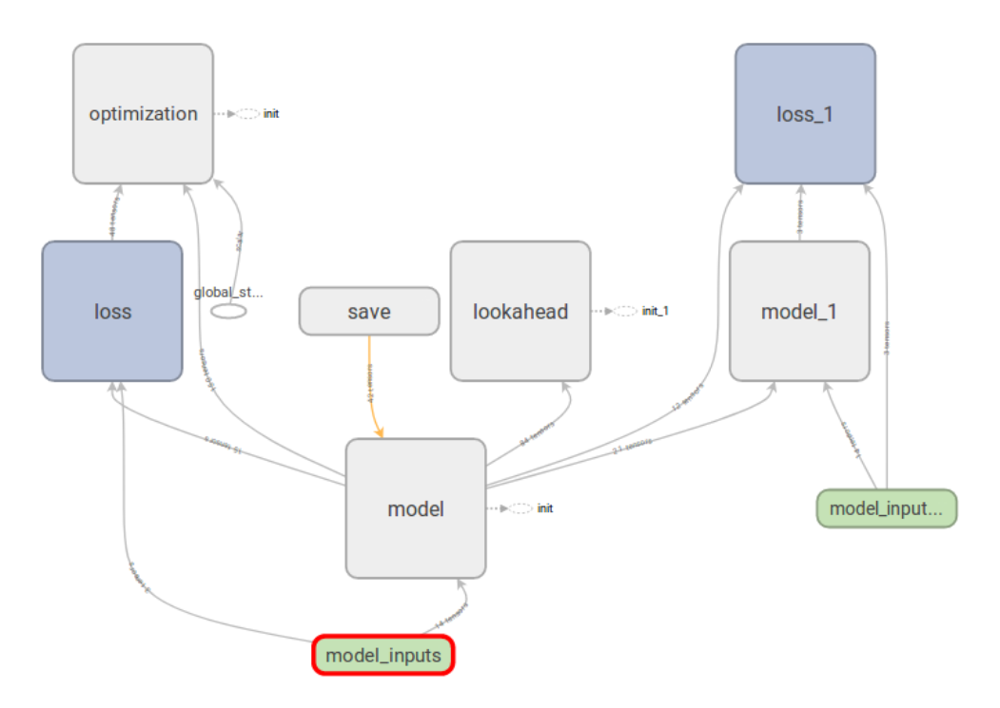
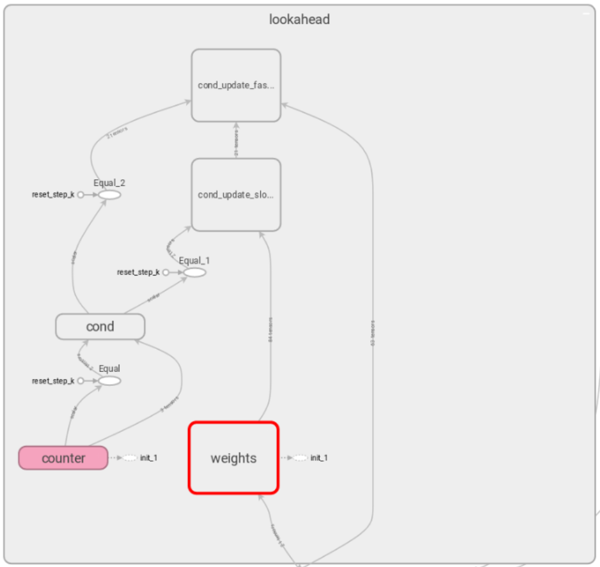

# lookahead_tensorflow
Lookahead optimizer (["Lookahead Optimizer: k steps forward, 1 step back"](https://arxiv.org/abs/1907.08610)) for tensorflow

### Environment 
This code is implemmented and tested with [tensorflow](https://www.tensorflow.org/) 1.11.0. and 1.13.0 \
I didn't use any spetial operator, so it should also work for other version of tensorflow.

### Usage
1. Please assert the class after all variable initialization, and initialize the BaseLoookAhead with all trainable variables.
```
import tensorflow as tf
from lookahead_opt import BaseLookAhead

"""
Build your model here
Please also include any optimizer you need.
"""

model_vars = [v for v in tf.trainable_variables()]
tf.global_variables_initializer().run()

lookahead = BaseLookAhead(model_vars, k=5, alpha=0.5)
```
Arguments are define as follows:
> model_vars: the variables to be lookahead. [list]\
> k: the number of steps that fast weights go forward. [int]\
> alpha: The learning rate for merging slow to fast weight. [float]


2. Add the assign operator to training operation or directly run in session.

```
# Add to train_op
train_op += lookahead.get_ops()

# Or just run the Session
with tf.Session() as sess:
  _ = sess.run(lookahead.get_ops())
```

### Implementation Details

#### Inject Lookahead to model and save specific variables
The Lookahead is wrapped with default variable scope "lookahead".
After calling BaseLookAhead with specific variables, the variables will be injected to lookahead.\
Noted that, the lookahead class is totally separated from optimizer, please remember to add optimizer when creating training graph. 

</a>

The BaseLookAhead will create a duplicate tf.Variables to save the slow weight.
And a counter will be automatically create to do "k steps forward, 1 step back".

</a>

#### Experimental results
I have conduct experiments on a many-to-many recursive task with stacked [weight-dropped LSTM](https://arxiv.org/abs/1708.02182). \
Using lookahead with Adam, the training loss is higher than the model without lookahead. But the validation loss with lookahead is slightly better.

### Contact & Copy Right
Code work by Jia-Yau Shiau <jiayau.shiau@gmail.com>.
